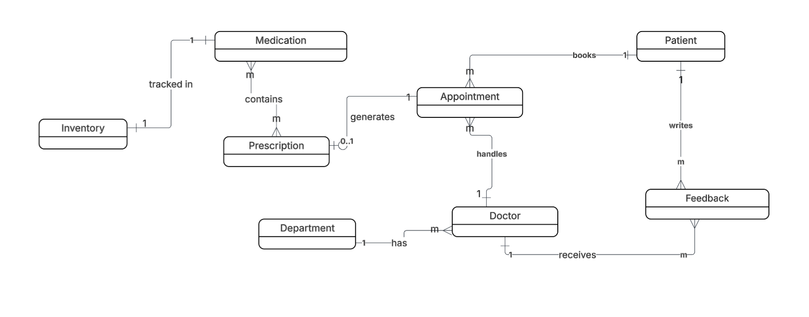
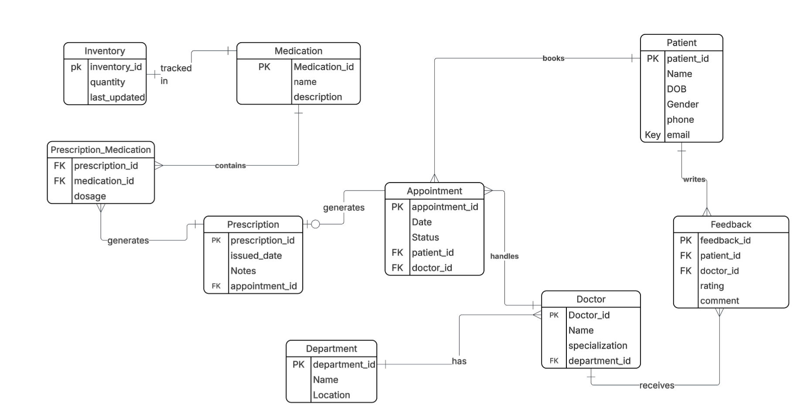

# Hospital Management System

## Overview
This project is a JavaFX-based Hospital Management System designed to manage patients, doctors, appointments, prescriptions, inventory, and reports. It uses a relational database with optimized queries and caching for improved performance.

## Features
- Patient and doctor management (CRUD)
- Appointment scheduling
- Prescription and medication tracking
- Inventory management
- Advanced reporting and analytics
- In-memory caching and search optimization

## Technologies Used
- Java (JDK 21+)
- JavaFX
- JDBC
- Postgres
- Maven

## Database Setup
1. Create a postgres database
2. Run `schema.sql` to create tables
3. Run `sample_data.sql` to populate initial data

## Screenshots of ERDs
1. Conceptual ERD

2. Logical ERD
 

## Running the Application
1. Open the project in IntelliJ IDEA
2. Configure database connection in `DBConnection.java`
3. Run the `Start.java` class

## Project Structure
- `Controller` – JavaFX controllers
- `Service` – Business logic and caching
- `DAO` – Database access layer (JDBC)
- `Models` – Entities and DTOs
- `Resources` – FXML and assets

## Performance Optimization
- Indexes applied on frequently queried columns
- In-memory caching used in Service classes
- JavaFX in-memory sorting and filtering

## Author
Bruce Mutsinzi
